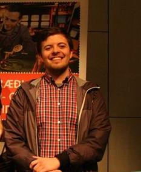

  School of Chemical, Biological, and Environmental Engineering 

<figure>
    

    
    

</figure>

# Assistant Professor

{:style="float: left;margin-right: 7px;margin-top: 7px; width: 30%;"}
Cory Simon 
Cory.Simon [at] oregonstate.edu 
Gleeson Hall 211  
<a href="https://twitter.com/CoryMSimon" data-size="large" class="twitter-follow-button" data-show-count="false">Follow @CoryMSimon</a>  
<a href="{{ site.url }}/CorySimonCV.pdf">Full Curriculum Vitae</a>. 

**Education**

| ----------------------------- | ---------------------------------------- | --------- |
| Fellow, Computational Biology | Altius Institute for Biomedical Sciences | 2017      |
| Ph.D. Chemical Engineering    | University of California, Berkeley       | 2012-2016 |
| <s>Ph.D.</s> Mathematics      | University of British Columbia           | 2010-2012 |
| B.S. Chemical Engineering     | The University of Akron                  | 2005-2010 |

 
**Professional Experience**

| ------------------------------------------- | ----------------- | --- |
| École polytechnique fédérale de Lausanne    | Visiting Scholar | 2016 |
| Lawrence Berkeley National Laboratory       | DOE Fellow | 2015 |
| Stitch Fix                                  | Data Scientist | 2014 |
| Okinawa Institute of Science and Technology | Research Intern | 2012 |
| Bridgestone Research                        | Chemical Engineering Co-op | 2007-2009 |

 
Cory digs hiking/backpacking in scenic places (photos on <a href="https://ello.co/cokes">Ello</a>), snowboarding, and wine. 

# Ph.D. students

{:style="float: left;margin-right: 7px;margin-top: 7px; width: 30%;"}
Arni Sturluson 
B.Sc. Chemistry. University of Iceland. (2012-2015) 
*Research interests:* using machine learning algorithms from computer vision to analyze nanoporous materials
  
I really like music, and my most played artist in 2017 was MF DOOM. I'm an avid football fan, and my team, Manchester City, is currently in the lead in the Premier League.

# Undergraduate students

{:style="float: left;margin-right: 7px;margin-top: 7px; width: 30%;"}
Mira Khare 
*Major:* Chemical Engineering 
*Research interests:* using machine learning to extract biological insights from large genomic data sets

---
{:style="float: left;margin-right: 7px;margin-top: 7px; width: 30%;"}
Rachel Sousa 
*Major:* Mathematics 
*Research interests:* mathematical modeling of self-organizing vegetation in arid landscapes
  
I enjoy painting, cooking, and outdoor activities such as hiking, golfing, and wakesurfing.

--- 
{:style="float: left;margin-right: 7px;margin-top: 7px; width: 30%;"}
Arthur Henry York 
*Major:* Computer Science 
*Research interests:* molecular simulations in flexible, nanoporous materials; software development
  
My favorite TV show is Battlestar Galactica, and my favorite board game is Hansa Teutonica.

